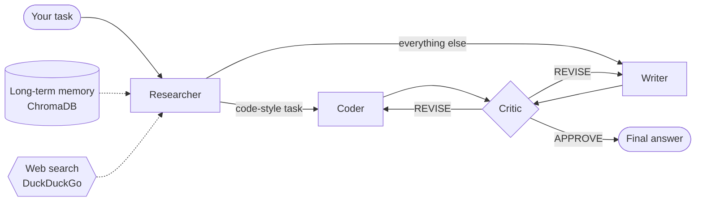

<div align="center">

# Aether

**A small council of AI agents that researches, writes, and checks its own work.**

Ask Aether anything. She and her team will get you the answers. They're all very smart.


</div>

---

Aether is a multi-agent assistant built with **LangGraph**. Instead of one model answering in a single shot, your question goes to a small team: a researcher gathers facts from the web and from past runs, a writer or coder drafts the answer, and a critic reviews it and sends it back for another pass if needed. You can watch each agent work in real time from a cozy pixel-art web UI.

## Meet the team

| Agent | Role |
| --- | --- |
| 🔎 **Researcher** | Searches the web (DuckDuckGo) and Aether's long-term memory, then writes concise, factual notes. |
| ✍️ **Writer** | Turns the research notes into a clear, well-structured answer. |
| 💻 **Coder** | For programming tasks: writes a self-contained Python script, **runs it in a sandbox**, and returns the code with its real output. |
| 🧐 **Critic** | Reviews the draft against the original task and replies `APPROVE` or `REVISE`, with specific feedback. |

## How it works



1. **Research.** The researcher pulls up to 3 similar past runs from ChromaDB (filtered by a similarity threshold) and runs a live web search. It's told to prefer fresh search results over its own built-in knowledge.
2. **Route.** If the task looks like a coding task (keywords like *code*, *script*, *python*, *algorithm*, *calculate*), it goes to the coder. Otherwise it goes to the writer.
3. **Draft.** The writer produces prose, or the coder writes a script and executes it.
4. **Review.** The critic approves the draft or sends it back to whichever agent wrote it. The loop is capped by `MAX_ITERATIONS` in `orchestrator.py`, which allows up to two rewrites.
5. **Remember.** Runs started from the UI (over WebSocket) are saved to SQLite. They're also added to long-term memory, but **only if the web search succeeded**. This keeps answers built purely on the model's own guesses from being stored and reused later.

## Features

- **Multi-agent orchestration** with a LangGraph `StateGraph` and conditional routing
- **Live progress streaming** over WebSockets, so the UI shows each agent as it works
- **Long-term memory**: past answers are embedded in ChromaDB and recalled for similar tasks
- **Web-grounded research** via DuckDuckGo search, with no extra API key needed
- **Sandboxed code execution**: 5-second timeout, CPU limit, 100 MB memory cap (Linux), and a stripped environment
- **Run history** stored in SQLite and available from the API
- **API-key authentication** on every REST and WebSocket endpoint
- **Pixel-art frontend** with a bouncing blob mascot, built with Next.js 16 and Tailwind CSS v4
- **Docker Compose** setup for running both services with one command

## Tech stack

| Layer | Tools |
| --- | --- |
| Agents and orchestration | LangGraph, LangChain |
| LLM | Groq (`openai/gpt-oss-120b` by default, configurable) |
| Backend API | FastAPI, Uvicorn, WebSockets |
| Storage | SQLite (SQLModel) for run history, ChromaDB for vector memory |
| Tools | `ddgs` (DuckDuckGo search), subprocess-based Python sandbox |
| Frontend | Next.js 16, React 19, TypeScript, Tailwind CSS v4 |

## Getting started

### Prerequisites

- A free [Groq API key](https://console.groq.com/keys)
- **Docker** (recommended), or **Python 3.12+** and **Node.js 20+**
- macOS or Linux. The code sandbox uses Unix resource limits, so it won't run natively on Windows. Use WSL or Docker there.

### 1. Clone the repo

```bash
git clone https://github.com/anushka11p/Aether.git
cd Aether
```

### 2. Configure the backend

Create `backend/.env`:

```env
GROQ_API_KEY=your_groq_api_key
AETHER_API_KEY=pick-any-long-random-string

# Optional: any chat model available on Groq
# GROQ_MODEL=openai/gpt-oss-120b
```

`AETHER_API_KEY` is a shared secret you make up. The frontend sends it with every request, and the backend rejects any request that doesn't include it.

### 3a. Run with Docker

Docker Compose passes the API key to the frontend from your shell or from a `.env` file in the **repo root**:

```bash
echo "AETHER_API_KEY=pick-any-long-random-string" > .env   # must match backend/.env
docker compose up --build
```

Then open **http://localhost:3000**.

### 3b. Run locally (without Docker)

**Backend:**

```bash
cd backend
python -m venv venv
source venv/bin/activate
pip install -r requirements.txt
uvicorn app.main:app --reload --port 8000
```

**Frontend** (in a second terminal):

```bash
cd frontend
echo "NEXT_PUBLIC_AETHER_API_KEY=pick-any-long-random-string" > .env.local   # must match backend/.env
npm install
npm run dev
```

Open **http://localhost:3000**, type a task, and press **RUN**.

> [!NOTE]
> On the first run, ChromaDB downloads a small embedding model. The first request may take a little longer than usual.

## Configuration

| Variable | Where | Default | Description |
| --- | --- | --- | --- |
| `GROQ_API_KEY` | `backend/.env` | none | Your Groq API key (required) |
| `GROQ_MODEL` | `backend/.env` | `openai/gpt-oss-120b` | Groq model used by all agents |
| `AETHER_API_KEY` | `backend/.env` | none | Shared secret the API requires on every call |
| `NEXT_PUBLIC_AETHER_API_KEY` | `frontend/.env.local` | none | Same value as `AETHER_API_KEY`, used by the browser |

Agent behaviour can be tuned in code:

| Setting | File |
| --- | --- |
| `MAX_ITERATIONS`, `CODE_KEYWORDS` | `backend/app/agents/orchestrator.py` |
| `TIMEOUT_SECONDS`, `MAX_MEMORY_MB` | `backend/app/tools/code_executor.py` |
| `n_results`, `max_distance` (memory recall) | `backend/app/memory/vector_store.py` |
| Agent system prompts | `backend/app/agents/*.py` |

## API

The backend runs on `http://localhost:8000`. Interactive docs are available at `/docs`.

### `WS /ws/run`: stream a run (used by the UI)

Send one JSON message after connecting:

```json
{ "task": "Explain how vector databases work", "api_key": "<AETHER_API_KEY>" }
```

You'll receive one event per agent step, followed by the final result:

```json
{ "type": "step", "agent": "researcher", "iteration": 1 }
{ "type": "step", "agent": "writer", "iteration": 2 }
{ "type": "step", "agent": "critic", "iteration": 3 }
{ "type": "done", "final_output": "...", "iterations": 3 }
```

If the key is wrong, you'll get `{ "type": "error", "message": "Unauthorized" }`. WebSocket runs are saved to history and long-term memory.

### `POST /api/run`: run a task and wait for the answer

```bash
curl -X POST http://localhost:8000/api/run \
  -H "Content-Type: application/json" \
  -H "X-API-Key: $AETHER_API_KEY" \
  -d '{"task": "Write a Python function that checks if a number is prime"}'
```

```json
{ "final_output": "...", "iterations": 3 }
```

### `GET /api/history`: past runs, newest first

```bash
curl http://localhost:8000/api/history -H "X-API-Key: $AETHER_API_KEY"
```

### `GET /`: health check

Returns `{ "status": "ok", "project": "Aether" }`.

## Project structure

```
Aether/
├── backend/
│   ├── app/
│   │   ├── agents/
│   │   │   ├── base_agent.py      # Shared agent base class
│   │   │   ├── researcher.py      # Web search + memory, writes notes
│   │   │   ├── writer.py          # Drafts prose answers
│   │   │   ├── coder.py           # Writes and executes Python
│   │   │   ├── critic.py          # Approves or requests revisions
│   │   │   └── orchestrator.py    # LangGraph workflow and routing
│   │   ├── api/
│   │   │   ├── routes.py          # REST endpoints (/api/run, /api/history)
│   │   │   └── websocket.py       # Streaming endpoint (/ws/run)
│   │   ├── core/
│   │   │   ├── config.py          # Settings loaded from backend/.env
│   │   │   ├── llm_provider.py    # Groq chat model factory
│   │   │   ├── state.py           # Shared AgentState passed between agents
│   │   │   ├── database.py        # SQLite engine
│   │   │   └── security.py        # API-key check
│   │   ├── memory/
│   │   │   └── vector_store.py    # ChromaDB long-term memory
│   │   ├── models/
│   │   │   └── run.py             # Run history table
│   │   ├── tools/
│   │   │   ├── web_search.py      # DuckDuckGo search
│   │   │   └── code_executor.py   # Resource-limited Python runner
│   │   └── main.py                # FastAPI app entry point
│   ├── requirements.txt
│   └── Dockerfile
├── frontend/
│   ├── app/                       # Next.js App Router pages and styles
│   ├── components/
│   │   └── ChatInterface.tsx      # Pixel UI, mascot, and WebSocket client
│   ├── public/background.png
│   └── Dockerfile
├── scripts/                       # Manual test scripts
└── docker-compose.yml
```

## Testing

The `scripts/` folder has small scripts for trying out each piece. Run them from the repo root with the backend's virtualenv active:

```bash
python scripts/test_researcher.py      # researcher agent on its own
python scripts/test_coder.py           # coder agent + sandbox
python scripts/test_orchestrator.py    # full agent graph, no server needed

# With the backend running:
python scripts/test_websocket.py "What is LangGraph?"
```

## Security notes

Aether is designed to run on your own machine. Before exposing it publicly, keep the following in mind:

- **The code sandbox limits resources but doesn't isolate the code.** Generated scripts can still read files and reach the network on the host. For anything shared, run the backend in a container or a VM.
- **The frontend API key is visible in the browser.** Values prefixed with `NEXT_PUBLIC_` are bundled into client-side JavaScript.
- **CORS is limited to `http://localhost:3000`**, and the frontend connects to `ws://127.0.0.1:8000`. Update both before deploying elsewhere.

## Roadmap ideas

- [ ] Pass the critic's feedback to the writer and coder so revisions can address it
- [ ] Replace keyword routing with an LLM-based router
- [ ] Show the critic's feedback and research notes in the UI
- [ ] Render markdown and code blocks in the final answer
- [ ] Add a history view to the frontend
- [ ] Run generated code in a container-based sandbox

---

<div align="center">

Made with 🌱 by [Anushka Prasad](https://github.com/anushka11p)

</div>
